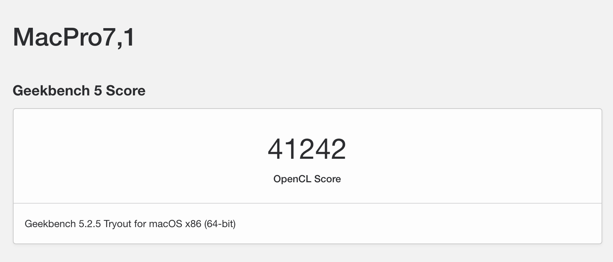

# TUF B360M Gaming PLUS/i5-9400F/蓝宝石RX5600XT opencore
***

## 配置
首先上配置单：
|  硬件   |  型号   |
| :----: | :----: |
| 主板  | TUF B360M Gaming PLUS |
| CPU  |  I5-9400F| 
| GPU  | 蓝宝石 RX5600XT | 
| SSD | 西数sn750 250G | 
| 内存 | 骇客神条 2666MHZ * 2 | 
| 机箱 | JONSBO C3-PLUS | 

## 目前实现情况
|  功能  | 实现 | 
| :----:  | :----: |
| CPU 睿频 |  正常 |
| GPU 硬件加速 | 正常
| 睡眠 | 正常（自己定制了USB）|
| HIDPI | 正常（AOC 4K） |

## 存在的问题
偶尔会绿屏死机，暂时还不知道是什么问题，在国外的reddit论坛上也有人问同样的问题，但是没有解决，希望有懂得大佬帮忙解决一下
[link](https://www.reddit.com/r/hackintosh/comments/gv1f62/amd_rx_5600_xt_green_screen_of_death/)

## 部分截图：
系统信息

```
由于没有核显，而且使用的是rx5600xt,因此使用的机型为 MacPro1,1
```
GPU硬解加速


Geekbench跑分




