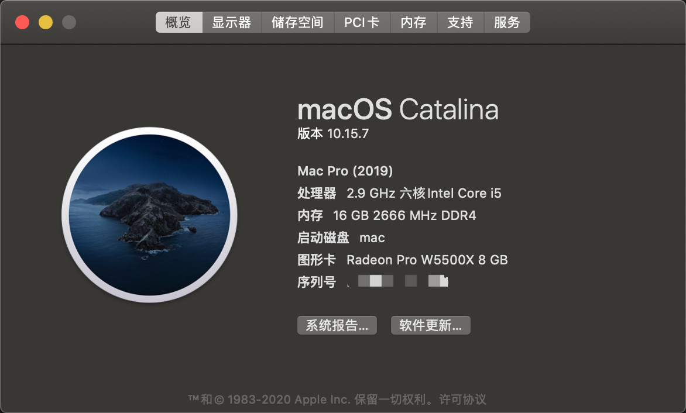
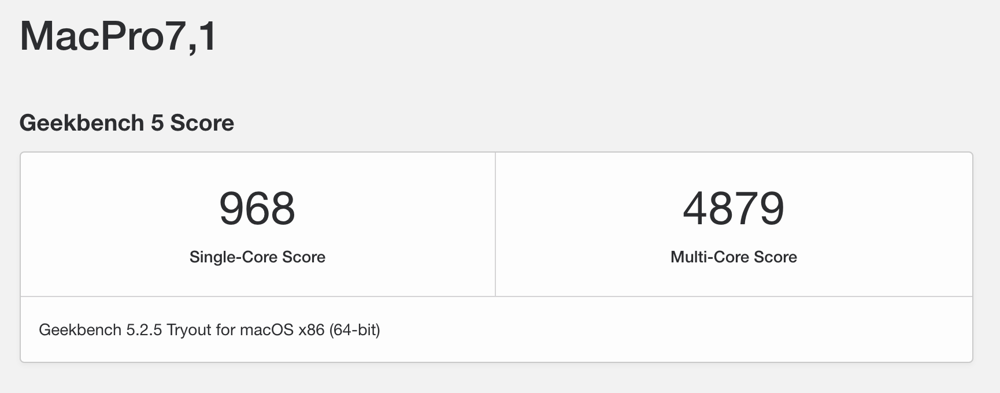

# TUF B360M Gaming PLUS/i5-9400F/蓝宝石RX5500XT opencore 完美黑苹果
***

## 配置
首先上配置单：
|  硬件   |  型号   |
| :----: | :----: |
| 主板  | TUF B360M Gaming PLUS |
| CPU  |  I5-9400F| 
| GPU  | 蓝宝石 RX5500XT | 
| SSD | 西数sn750 512G | 
| 内存 | 骇客神条 2666MHZ * 2 | 
| 机箱 | JONSBO C3-PLUS | 
| 网卡 | FenVi T919 BCM94360CD 四天线版本 | 
| 触摸板 | Magic TrackPad 2 | 

## 目前实现情况
|  功能  | 实现 | 
| :----:  | :----: |
| CPU 睿频 |  正常 |
| GPU 硬件加速 | 正常（伪造为W5500X 8G） | 
| 睡眠 | 正常（自己定制了USB，可以苹果二代触控板蓝牙激活）|
| HIDPI | 正常（AOC 4K） |
| WIFI  |  原生正常 | 
| 蓝牙   |  原生正常 | 

## 最近更新
更换拆机卡 BCM94360CD ， 购买了magic trackpad ， 支持了蓝牙设备睡眠下唤醒 ，体验不错。

## 存在的问题
~~偶尔会绿屏死机，暂时还不知道是什么问题，在国外的reddit论坛上也有人问同样的问题，但是没有解决，希望有懂得大佬帮忙解决一下
[link](https://www.reddit.com/r/hackintosh/comments/gv1f62/amd_rx_5600_xt_green_screen_of_death/)~~

之前的显卡是某鱼购买的，质量有问题，jd自营购买5500xt后，完美解决问题，从来没有出现过死机情况，用起来很完美。

## 部分截图：
系统信息

```
由于没有核显，而且使用的是rx5500xt,因此使用的机型为 MacPro7,1
```
GPU硬解加速


Geekbench跑分



